This workflow is more complex as it introduces multiple issue types and more states. Let's break it down in simple terms. Think of this as a more elaborate assembly line with different types of products ("Epics," "Stories," "Tasks," and "Grooming") moving through various stages.

**1. States:** These are the different stations on our assembly line.

* **Init:** The very beginning. Issues of type "Task" and "Grooming" start here (`is_default: True`, `is_first: True`). AI can work on these.
* **Backlog:** Items that are planned but not yet being actively worked on. "Story," "Task," and "Grooming" issues can be here, and AI can interact with them.
* **Think:** A stage for analyzing an issue and planning the work. "Story," "Task," and "Grooming" issues go through this, and AI can help with the thinking.
* **Work:** This is where the actual implementation happens. "Story," "Task," and "Grooming" issues are worked on, and AI is involved.
* **Test:** The code is checked. If it's good (`success: true`), it moves to "QA." If there are problems (`fail: true`), it goes to "Fixing." AI can assist in this state.
* **Fixing:** Issues found during testing are addressed here. "Story" and "Task" issues that failed testing come here. If the fixes are successful, they go to "QA"; if not, "Task" issues go to "Help."
* **Help:** This is a special state for "Grooming" tasks that need human intervention for bug fixing.
* **QA (Quality Assurance):** Humans test the "Story" code. If it passes (`success: true`), it goes to "Deploy." If it fails (`fail: true`), it goes back to "Think" for further analysis. AI can work on "Task" and "Grooming" issues here.
* **Deploy:** The code is merged into the main branch. "Story," "Task," and "Grooming" issues are deployed, and AI can be involved.
* **Done:** The final stage, meaning the issue is completed (`is_closed: True`). No AI interaction here.

**2. Transitions:** These are the paths the different types of work items can take through the states.

* Everything starts at **Init** and moves to **Backlog**.
* From **Backlog**, items go to **Think**, then to **Work**, then to **Test**.
* From **Test**, if successful, to **QA**; if failed, to **Fixing**.
* From **Fixing**, if successful, to **QA**; if failed (for "Task"), to **Help**.
* From **Help**, items go to **QA**.
* From **QA**, if successful, to **Deploy**; if failed, back to **Think**.
* Finally, from **Deploy**, everything reaches **Done**.

**3. Issue Types:** Now we have different kinds of work items, each with its own description and specific jobs (AI actions) within certain states.

* **Epic:** Think of this as a large container or theme for related "Stories." It provides general guidelines. In this workflow, "Epics" mostly just move through the states without specific AI jobs defined in each state (they all have `command: next`, meaning they just progress).

* **Story:** Represents a significant piece of work that will likely require multiple "Tasks."
    * **Backlog:** Just moves to the next stage.
    * **Think:** AI gathers context files, then acts like a Project Manager to analyze the requirements, define features, user experience, prioritize, consider edge cases, and structure this as a comment for the engineering team. It then tries to summarize if the task was already worked on and if adjustments are needed based on comments, potentially leading to the creation of new "Task" issues.
    * **Work:** AI creates new "Task" issues based on the planning in the "Think" stage, providing detailed descriptions and mentioning the scope of files to be worked on.
    * **Test, Fixing, Help, Deploy:** Primarily move to the next stage.

* **Task:** These are the small, individual coding assignments that make up a "Story."
    * **Init, Backlog:** Just move to the next stage.
    * **Think:** AI locates relevant code files and suggests ways to resolve the "Task," focusing only on the code related to the "Task" and ensuring no unintended side effects.
    * **Work:** AI uses a tool called "aider" to implement the code based on the ticket description and recent comments, then reformats the code and commits the changes.
    * **Test:** AI runs code linters and tests, then analyzes the output. If there are errors, it pinpoints the files and creates new "Grooming" issues to fix them. It then evaluates the test results.
    * **Fixing:** AI reruns linters and tests and evaluates the results.
    * **Help, QA, Deploy:** Primarily move to the next stage.

* **Grooming:** These are specific tasks created to fix issues found during the "Test" phase of a "Task."
    * **Init, Backlog, Think, Test, QA:** Just move to the next stage.
    * **Work:** AI uses "aider" to implement the fixes based on the "Grooming" issue description and last comments, but it's restricted from creating new files or running new commands. It then reformats the code and commits the changes.
    * **Deploy:** Merges the code.

**4. Priorities:** This section dictates the order in which the AI should pick up issues. It prioritizes "Grooming" issues first across all states, then "Task" issues, then "Story" issues, and finally "Epic" issues. Within each issue type, it seems to prioritize issues in the "Deploy" state first, then "Fixing," then "Help," and so on, down to "Init." This suggests that the AI should focus on getting things finalized ("Deploy," "Fixing") before starting new work ("Init," "Backlog").

**In Simple Terms:**

This workflow manages different levels of work:

* **Epics** are like themes.
* **Stories** are big features broken down into smaller **Tasks**.
* **Grooming** tasks are specifically for cleaning up code after testing.

Each type of issue moves through a defined process: planning ("Think"), doing ("Work"), checking ("Test," "QA"), fixing ("Fixing," "Help"), and finally shipping ("Deploy," "Done"). The AI has specific roles to play in many of these stages, from helping with planning and coding to identifying and creating tasks for fixing errors. The priority list ensures the AI focuses on the most critical or closest-to-completion items first.

* Sequence Diagram *

```mermaid
sequenceDiagram
    actor User
    participant AndAI
    participant Redmine as Ticketing System
    participant Git as Version Control
    participant AI_LLM as AI/LLM (e.g., Aider)

    User->>+Redmine: Create Ticket (e.g., Story)
    Redmine-->>-User: Ticket Created (ID: 123, State: Init/Backlog)

    loop Work Cycle
        AndAI->>+Redmine: Query for actionable tickets (based on priorities/states)
        Redmine-->>-AndAI: Return highest priority ticket (ID: 123, State: Backlog)

        AndAI->>+Git: Checkout parent/final branch
        Git-->>-AndAI: Branch checked out
        AndAI->>+Git: Create/Checkout task branch (e.g., AI-123)
        Git-->>-AndAI: Task branch ready

        AndAI->>AndAI: Load workflow config for Issue Type & State
        Note over AndAI: Determine steps for Story in Backlog

        %% Example: Step 1 - Summarize Task %%
        AndAI->>+Redmine: Get context (Ticket details, Comments, Wiki)
        Redmine-->>-AndAI: Context data
        AndAI->>+AI_LLM: Summarize task (Prompt + Context)
        AI_LLM-->>-AndAI: Summary generated
        opt Add summary as comment
            AndAI->>+Redmine: Add Comment (Summary)
            Redmine-->>-AndAI: Comment added
        end

        %% Example: Step 2 - Create Sub-Tasks %%
        AndAI->>+AI_LLM: Generate Sub-Tasks (Prompt + Context + Summary)
        AI_LLM-->>-AndAI: List of Sub-Tasks (descriptions)
        loop For each Sub-Task
            AndAI->>+Redmine: Create Child Issue (Task)
            Redmine-->>-AndAI: Child Issue Created (ID: 124)
        end

        %% Example: Step 3 - Move Parent to Next State %%
        AndAI->>+Redmine: Update Ticket State (ID: 123 -> In Progress)
        Redmine-->>-AndAI: State Updated

        %% AndAI might pick up a child task (e.g., Task ID: 124) in the next cycle %%
        AndAI->>+Redmine: Query for actionable tickets
        Redmine-->>-AndAI: Return Task (ID: 124, State: Backlog)

        AndAI->>+Git: Checkout parent branch (AI-123)
        Git-->>-AndAI: Branch checked out
        AndAI->>+Git: Create/Checkout task branch (AI-124)
        Git-->>-AndAI: Task branch ready

        AndAI->>AndAI: Load workflow config for Task in Backlog
        Note over AndAI: Determine steps for Task in Backlog

        %% Example: Step 1 - Aider Code Generation %%
        AndAI->>+Redmine: Get context (Ticket details, Parent, Comments)
        Redmine-->>-AndAI: Context data
        AndAI->>+Git: Get affected files context (optional)
        Git-->>-AndAI: File list/content
        AndAI->>+AI_LLM: Execute Aider 'code' (Prompt + Context + Files)
        Note right of AI_LLM: Aider interacts with Git directly
        AI_LLM->>+Git: Read files, Make changes
        Git-->>-AI_LLM: File access
        AI_LLM->>+Git: Commit changes
        Git-->>-AI_LLM: Changes committed
        AI_LLM-->>-AndAI: Aider execution finished (Output/Status)
        opt Comment Aider output
            AndAI->>+Redmine: Add Comment (Aider Output)
            Redmine-->>-AndAI: Comment added
        end

        %% Example: Step 2 - Run Tests (Project Command) %%
        AndAI->>AndAI: Execute 'project-cmd test'
        Note over AndAI: Runs command like 'make test' in repo dir
        AndAI->>+Redmine: Add Comment (Test Results)
        Redmine-->>-AndAI: Comment added

        %% Example: Step 3 - Evaluate Results %%
        AndAI->>+Redmine: Get context (Recent comments - Test Results)
        Redmine-->>-AndAI: Context data
        AndAI->>+AI_LLM: Evaluate success/failure (Prompt + Context)
        AI_LLM-->>-AndAI: Evaluation Result (Success/Fail)

        alt Evaluation Success
            AndAI->>+Redmine: Update Ticket State (ID: 124 -> QA/Review)
            Redmine-->>-AndAI: State Updated
        else Evaluation Fail
            AndAI->>+Redmine: Update Ticket State (ID: 124 -> Analysis/Backlog)
            Redmine-->>-AndAI: State Updated
        end

        %% ... More steps and cycles ... %%

        %% Eventually, a task reaches a review state %%
        AndAI->>+Redmine: Query for actionable tickets
        Redmine-->>-AndAI: Return Task (ID: 124, State: Review)
        Note over AndAI: No AI steps defined for 'Review', waiting for User

    end

    User->>+Redmine: Check Ticket Status (ID: 124)
    Redmine-->>-User: Status: Review
    User->>+Git: Review code on branch AI-124
    Git-->>-User: Code diff

    alt User Approves
        User->>+Redmine: Update Ticket State (ID: 124 -> Deployment/Done)
        Redmine-->>-User: State Updated

        %% AndAI picks up approved task for merge %%
        AndAI->>+Redmine: Query for actionable tickets
        Redmine-->>-AndAI: Return Task (ID: 124, State: Deployment)
        AndAI->>+Git: Checkout parent branch (AI-123)
        Git-->>-AndAI: Branch checked out
        AndAI->>+Git: Merge task branch (AI-124)
        Git-->>-AndAI: Merge successful
        AndAI->>+Redmine: Update Ticket State (ID: 124 -> Done)
        Redmine-->>-AndAI: State Updated (Closed)

        opt Trigger Parent Update
            Note over AndAI, Redmine: If all siblings are Done, Trigger moves Parent (ID: 123) to next state (e.g., Review)
            AndAI->>+Redmine: Update Ticket State (ID: 123 -> Review)
            Redmine-->>-AndAI: State Updated
        end

    else User Rejects
        User->>+Redmine: Add Comment (Reason for rejection)
        Redmine-->>-User: Comment added
        User->>+Redmine: Update Ticket State (ID: 124 -> Analysis/Backlog)
        Redmine-->>-User: State Updated
        Note over AndAI: AndAI will pick up rejected task in the next cycle
    end
```

